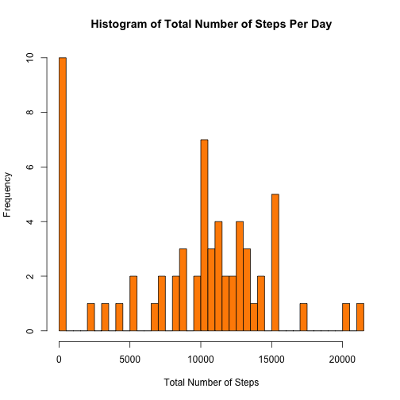
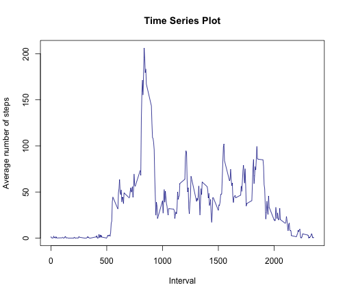
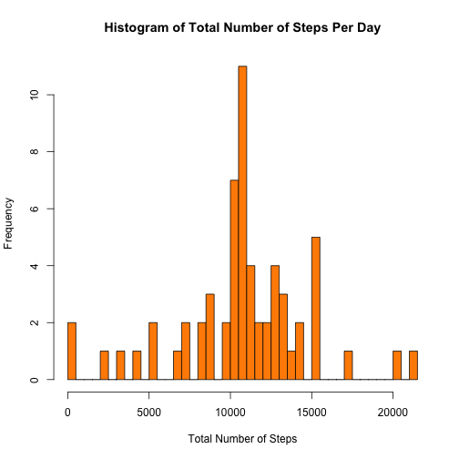
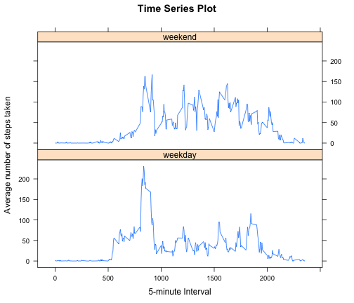

# Reproducible Research: Peer Assessment 1
Before we begin, we need to first load the following three packages as we
will be using them later.


```r
require(dplyr)
require(ggplot2)
require(lattice)
```

*****

## Loading and preprocessing the data
### 1. Load the data
The following code unzips the file, and reads in the data and store the data
in the object *rawdata*. A summary of the *rawdata* object is also shown.


```r
unzip("activity.zip", overwrite = TRUE)
rawdata <- read.csv("activity.csv")
summary(rawdata)
```

```
##      steps              date          interval   
##  Min.   :  0    2012-10-01:  288   Min.   :   0  
##  1st Qu.:  0    2012-10-02:  288   1st Qu.: 589  
##  Median :  0    2012-10-03:  288   Median :1178  
##  Mean   : 37    2012-10-04:  288   Mean   :1178  
##  3rd Qu.: 12    2012-10-05:  288   3rd Qu.:1766  
##  Max.   :806    2012-10-06:  288   Max.   :2355  
##  NA's   :2304   (Other)   :15840
```

### 2. Process/transform the data (if necessary) into a format suitable for your analysis
We will also be converting the *date* variable to **Date** format, as well as formatting the *interval* to a consistent **4-digit format** by adding leading 0(s) for consistency.


```r
rawdata$date <- as.Date(rawdata$date)
rawdata$interval <- formatC(rawdata$interval, width=4, format="d", flag="0")
```

*****

## What is mean total number of steps taken per day?
### 1. Calculate the total number of steps taken per day

```r
## Group the data by date
perday <- group_by(rawdata, date)
## Calculate total number of steps taken per day
stepsperday <- summarize(perday, steps.per.day=sum(steps, na.rm=TRUE))
## Display the results in a table format
kable(stepsperday, align="c")
```


|    date    | steps.per.day |
|:----------:|:-------------:|
| 2012-10-01 |       0       |
| 2012-10-02 |      126      |
| 2012-10-03 |     11352     |
| 2012-10-04 |     12116     |
| 2012-10-05 |     13294     |
| 2012-10-06 |     15420     |
| 2012-10-07 |     11015     |
| 2012-10-08 |       0       |
| 2012-10-09 |     12811     |
| 2012-10-10 |     9900      |
| 2012-10-11 |     10304     |
| 2012-10-12 |     17382     |
| 2012-10-13 |     12426     |
| 2012-10-14 |     15098     |
| 2012-10-15 |     10139     |
| 2012-10-16 |     15084     |
| 2012-10-17 |     13452     |
| 2012-10-18 |     10056     |
| 2012-10-19 |     11829     |
| 2012-10-20 |     10395     |
| 2012-10-21 |     8821      |
| 2012-10-22 |     13460     |
| 2012-10-23 |     8918      |
| 2012-10-24 |     8355      |
| 2012-10-25 |     2492      |
| 2012-10-26 |     6778      |
| 2012-10-27 |     10119     |
| 2012-10-28 |     11458     |
| 2012-10-29 |     5018      |
| 2012-10-30 |     9819      |
| 2012-10-31 |     15414     |
| 2012-11-01 |       0       |
| 2012-11-02 |     10600     |
| 2012-11-03 |     10571     |
| 2012-11-04 |       0       |
| 2012-11-05 |     10439     |
| 2012-11-06 |     8334      |
| 2012-11-07 |     12883     |
| 2012-11-08 |     3219      |
| 2012-11-09 |       0       |
| 2012-11-10 |       0       |
| 2012-11-11 |     12608     |
| 2012-11-12 |     10765     |
| 2012-11-13 |     7336      |
| 2012-11-14 |       0       |
| 2012-11-15 |      41       |
| 2012-11-16 |     5441      |
| 2012-11-17 |     14339     |
| 2012-11-18 |     15110     |
| 2012-11-19 |     8841      |
| 2012-11-20 |     4472      |
| 2012-11-21 |     12787     |
| 2012-11-22 |     20427     |
| 2012-11-23 |     21194     |
| 2012-11-24 |     14478     |
| 2012-11-25 |     11834     |
| 2012-11-26 |     11162     |
| 2012-11-27 |     13646     |
| 2012-11-28 |     10183     |
| 2012-11-29 |     7047      |
| 2012-11-30 |       0       |

### 2. Make a histogram of the total number of steps taken each day

```r
hist(stepsperday$steps.per.day, breaks=50, col="darkorange", border="black",
     main="Histogram of Total Number of Steps Per Day",
     xlab="Total Number of Steps",
     ylab="Frequency")
```

 

### 3. Calculate and report the mean and median of the total number of steps taken per day

```r
mean(stepsperday$steps.per.day)
```

```
## [1] 9354
```

```r
median(stepsperday$steps.per.day)
```

```
## [1] 10395
```

*****

## What is the average daily activity pattern?
### 1. Make a time series plot (i.e. type = "l") of the 5-minute interval (x-axis) and the average number of steps taken, averaged across all days (y-axis)

```r
## Group by time interval
perinterval <- group_by(rawdata, interval)
## Calculate the average number of steps across all days per 5-minute interval
avgperinterval <- summarize(perinterval, average.steps=mean(steps, na.rm=TRUE))
## Plot the time series plot
plot(avgperinterval$interval, avgperinterval$average.steps, type="l",
     col="darkblue", main="Time Series Plot",
     xlab="Interval",
     ylab="Average number of steps")
```

 

### 2. Which 5-minute interval, on average across all the days in the dataset, contains the maximum number of steps?

```r
avgperinterval[which.max(avgperinterval$average.steps),]$interval
```

```
## [1] "0835"
```

*****

## Imputing missing values
Note that there are a number of days/intervals where there are missing values (coded as NA). The presence of missing days may introduce bias into some calculations or summaries of the data.

### 1. Calculate and report the total number of missing values in the dataset (i.e. the total number of rows with NAs)

```r
sum(is.na(rawdata$steps))
```

```
## [1] 2304
```

### 2. Devise a strategy for filling in all of the missing values in the dataset. The strategy does not need to be sophisticated. For example, you could use the mean/median for that day, or the mean for that 5-minute interval, etc.
My strategy is to replace all missing values with the correspending mean for that 5-minute interval.

### 3. Create a new dataset that is equal to the original dataset but with the missing data filled in.
First, replicate the data set to be imputed.

```r
imputeddata <- data.frame(rawdata)
```

Next, we will replace all NAs with corresponding values.

```r
for (i in 1:dim(imputeddata)[1]) {
    if (is.na(imputeddata[i,]$steps)) {
        relevant.interval <- imputeddata[i,]$interval
        imputeddata[i,]$steps <- avgperinterval[avgperinterval$interval == relevant.interval,]$average.steps 
    }
}
```

Summary of the imputed data set:

```r
summary(imputeddata)
```

```
##      steps          date              interval        
##  Min.   :  0   Min.   :2012-10-01   Length:17568      
##  1st Qu.:  0   1st Qu.:2012-10-16   Class :character  
##  Median :  0   Median :2012-10-31   Mode  :character  
##  Mean   : 37   Mean   :2012-10-31                     
##  3rd Qu.: 27   3rd Qu.:2012-11-15                     
##  Max.   :806   Max.   :2012-11-30
```

### 4a. Make a histogram of the total number of steps taken each day.

```r
## Group data by date
imputed.perday <- group_by(imputeddata, date)
## Calculate total number of steps taken per day
imputed.stepsperday <- summarize(imputed.perday, steps.per.day=sum(steps))
## Plot the histogram
hist(imputed.stepsperday$steps.per.day, breaks=50, col="darkorange", border="black",
     main="Histogram of Total Number of Steps Per Day",
     xlab="Total Number of Steps",
     ylab="Frequency")
```

 

### 4b. Calculate and report the mean and median total number of steps taken per day. 

```r
mean(imputed.stepsperday$steps.per.day)
```

```
## [1] 10766
```

```r
median(imputed.stepsperday$steps.per.day)
```

```
## [1] 10766
```

### 4c. Do these values differ from the estimates from the first part of the assignment? What is the impact of imputing missing data on the estimates of the total daily number of steps?
Yes, these values differ from the estimates from the first part of the assignment - both have increased.

As I did not omit the days with all intervals having NA values, and have attributed those NA values as 0 in the first part of the assignment, both mean and median would have taken into account these 0 values, and the mean would have been depressed due to those days with 0 steps.

As such, now that these 0 values have been replaced with values greater than 0, it is logically expected that both the mean and median would increase.

*****

## Are there differences in activity patterns between weekdays and weekends?
Use the dataset with the filled-in missing values for this part.

### 1. Create a new factor variable in the dataset with two levels – “weekday” and “weekend” indicating whether a given date is a weekday or weekend day.

```r
## Adding a new column to indicate the day
imputeddata$day <- weekdays(imputeddata$date)
## Changing 'Saturday' and 'Sunday' to 'weekend'
imputeddata$day[imputeddata$day == "Saturday" | imputeddata$day == "Sunday"] <- "weekend"
## Changing other days to 'weekday'
imputeddata$day[!imputeddata$day == "weekend"] <- "weekday"
## Changing the class of 'day' to factor
imputeddata$day <- as.factor(imputeddata$day)
```

Summary of the updated dataset:

```r
summary(imputeddata)
```

```
##      steps          date              interval              day       
##  Min.   :  0   Min.   :2012-10-01   Length:17568       weekday:12960  
##  1st Qu.:  0   1st Qu.:2012-10-16   Class :character   weekend: 4608  
##  Median :  0   Median :2012-10-31   Mode  :character                  
##  Mean   : 37   Mean   :2012-10-31                                     
##  3rd Qu.: 27   3rd Qu.:2012-11-15                                     
##  Max.   :806   Max.   :2012-11-30
```

```r
class(imputeddata$day)
```

```
## [1] "factor"
```

### 2. Make a panel plot containing a time series plot (i.e. type = "l") of the 5-minute interval (x-axis) and the average number of steps taken, averaged across all weekday days or weekend days (y-axis). 

```r
## Calculate average number of steps taken per time interval for each type
stepsbyday <- aggregate(imputeddata$steps, list(interval=as.numeric(imputeddata$interval), imputeddata$day), FUN="mean")
names(stepsbyday) <- c("interval","day","average.steps")
## Plot the panel plot
xyplot(stepsbyday$average.steps ~ stepsbyday$interval | stepsbyday$day, 
       layout=c(1,2),
       type="l", color="darkblue",
       main="Time Series Plot",
       xlab="5-minute Interval",
       ylab="Average number of steps taken")
```

 
